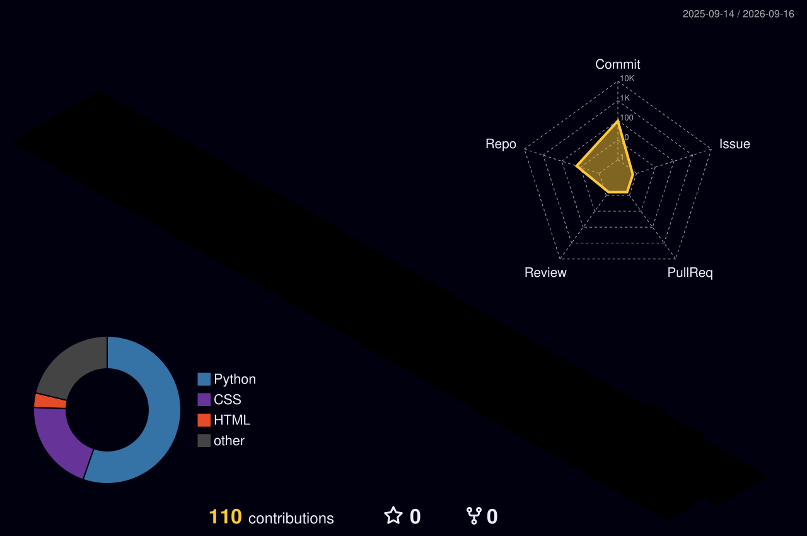

<div align="center">


<div align="center">

# ✨ ANSHU CHOURASIA

### AI/ML Developer • Data Science • Bioinformatics

<p>
  
</p>

</div>

---

## 🧬 About Me

- 🧬 Biology student exploring **Data Science & Artificial Intelligence**
- 🤖 Currently building an **AI Work Agent**
- 🧠 Currently learning **Machine Learning**
- 🐍 Working with **Python**
- 🗄️ Building stronger skills in **SQL**
- 📊 Learning **Excel with AI**
- 🔬 Long-term direction: **Data Science for Biology**
- 🚀 Interested in using AI and data to solve real-world problems

---
<h2 align="center">📊 My GitHub Contributions</h2>

<p align="center">
  
</p>
<h2 align="center">🐍 Contribution Snake</h2>

<p align="center">
  <picture>
    <source media="(prefers-color-scheme: dark)" srcset="profile/github-snake-dark.svg">
    <source media="(prefers-color-scheme: light)" srcset="profile/github-snake.svg">
    
  </picture>
</p>
---

<h2 align="center">🔥 GitHub Streak</h2>

<p align="center">
  
</p>

---

## 🚀 What I'm Building

<div align="center">

### 🤖 AI WORK AGENT

**An AI-powered system designed to automate real-world knowledge-work tasks.**

`Python` • `Machine Learning` • `AI Agents` • `Automation`

🚧 **Currently under development**

</div>

---

## 🛠️ Tech Stack

<div align="center">

### 👩‍💻 Languages


### 📊 Data Science & Machine Learning


### 🔧 Tools


</div>

---

## 📚 Currently Learning

```text
Python
   │
   ▼
Data Analysis
   │
   ├── SQL
   └── Excel + AI
   │
   ▼
Machine Learning
   │
   ▼
AI Agents
   │
   ▼
AI Work Agent
   │
   ▼
🧬 Data Science for Biology
