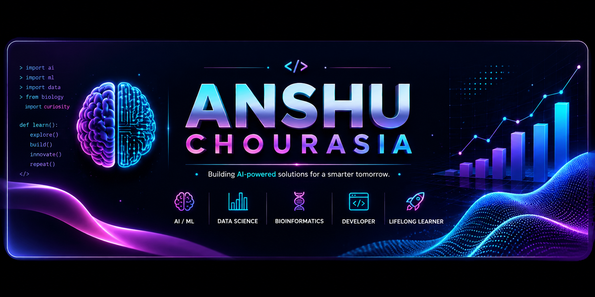

<p align="center">
  
</p>

<p align="center">
  <b>AI/ML Developer • Data Science • Bioinformatics</b>
</p>

---

## 🧬 About Me

- 🧬 Biology student exploring **Data Science & Artificial Intelligence**
- 🤖 Currently building an **AI Work Agent**
- 🧠 Currently learning **Machine Learning**
- 🐍 Working with **Python**
- 🗄️ Building stronger skills in **SQL**
- 📊 Learning **Excel with AI**
- 🔬 Long-term direction: **Data Science for Biology**
- 🚀 Interested in using AI and data to solve real-world problems

---
## 📊 GitHub Contributions

<p align="center">
  
</p>

---

## 🐍 Contribution Snake

<p align="center">
  
</p>

---

## 🔥 GitHub Streak

<p align="center">
  
</p>

## 🤖 What I'm Building

### AI WORK AGENT

An AI-powered system designed to automate real-world knowledge-work tasks.

`Python` • `Machine Learning` • `AI Agents` • `Automation`

🚧 **Currently under development**

---

## 🛠️ Tech Stack

### 👩‍💻 Languages

<p>
  
</p>

### 📊 Data Science & Machine Learning

<p>
  
</p>

### 🔧 Tools

<p>
  
</p>

---

## 📚 Currently Learning

```text
Python
   │
   ▼
Data Analysis
   │
   ├── SQL
   └── Excel + AI
   │
   ▼
Machine Learning
   │
   ▼
AI Agents
   │
   ▼
AI Work Agent
   │
   ▼
🧬 Data Science for Biology
